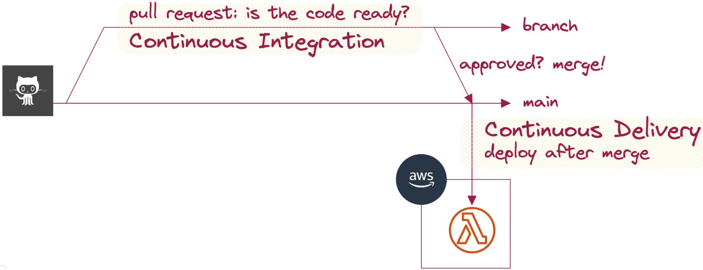
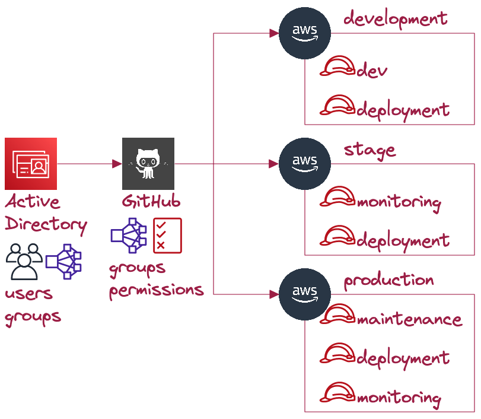

<!--
_class: invert
-->

# **Cloud and DevOps**

1. Hello Cloud
2. Software development
3. AWS & Serverless
4. Security in AWS
5. Advanced Security & CICD
6. 👉 **Testing, Cost and Security at Ohpen** 👈
7. Guest speaker

---

# **Previously in C&D ...**

Any questions about previous sessions and assignments?

---

---

# **Code in Github**

> Developers manage code in **branches** and create **pull requests** to **continuously integrate** their code to **main** branch.

Let's see it in the repository and Ohpen.

---

---

# **QA: Developers**

Developers usually do:

- **Manual**: Good for exploration.
- **Unit**: Focuses on a unit/function/class of code.

---

# **QA: Product managers**

Product Managers care about:

- **Component**: `Tests` **App** with _use-cases_.
- **Integration**: `Tests` **system** with _use-cases_.
- **End to end**: `Tests` **system** with _user stories_.
- **Performance**: `Stresses` **system** with _user stories_.

> Can you come up with examples?
> What is the difference between Component and Integration?

---

# **QA: When and How**

> Tests are evaluated based on: **Speed**, **Cost** and **Confidence**

- **Component**: Fastest - Low - Limited
- **Integration**: Slow - High - High
- **End to end**: Slow - High - Highest
- **Performance**: Slow - Highest - Highest

---

# **QA: As a PM ...**

- We should estimate the confidence ourselves.
- We should measure job execution in our CICD pipeline.
- How can I [estimate the cost](https://aws.amazon.com/products/?aws-products-all.sort-by=item.additionalFields.productNameLowercase&aws-products-all.sort-order=asc&awsf.re%3AInvent=*all&awsf.Free%20Tier%20Type=*all&awsf.tech-category=*all)?

> **Scenario**
> API gateway + Lambda + Dynamo
> vs
> Load balancer + EC2 + RDS

---

# **AWS Cost explorer**

How can we oversee costs in AWS?

- Reports
- Budgets
- [Unblended vs Amortized](https://aws.amazon.com/blogs/aws-cloud-financial-management/understanding-your-aws-cost-datasets-a-cheat-sheet/)
- How does Ohpen do it? The importance of tags.

---

# **IAM roles**

- Users belong to one person.
- Roles can be assumed if allowed.
- Roles don't have credentials but temporary keys.
- AWS services use IAM roles. [Let's see it](https://github.com/EduardBargues/bts_session5_13_06_2023).
- How are our lambdas allowed to access our Dynamodb?

---

# **Permissions at Ohpen**

- How users access AWS?
- How does Github deploy?
- How we ensure nobody can deploy from laptop?

---

---

# **Conclusions**

- **IAM roles** (and SSO) scale up permissions.
- Teams leverage **CICD** to **ensure** product **quality**.
- As a **PM**, we care about **use cases** and **user stories** and those are covered by **component**, **integration** and **e2e** testing.
- Leverage [AWS Cost explorer](https://aws.amazon.com/aws-cost-management/aws-cost-explorer/) and [documentation](https://aws.amazon.com/products/?nc2=h_ql_prod_fs_f&aws-products-all.sort-by=item.additionalFields.productNameLowercase&aws-products-all.sort-order=asc&awsf.re%3AInvent=*all&awsf.Free%20Tier%20Type=*all&awsf.tech-category=*all) to estimate and manage AWS costs.
